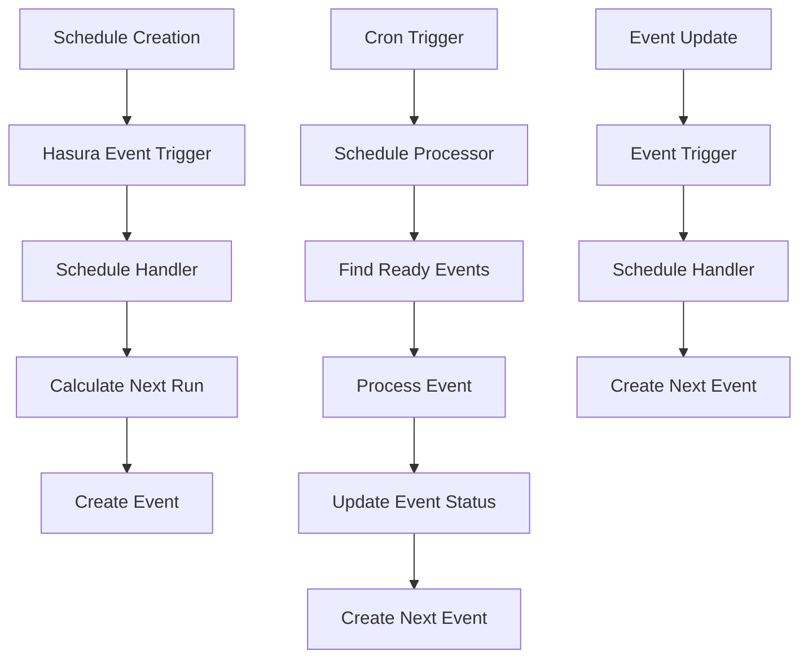
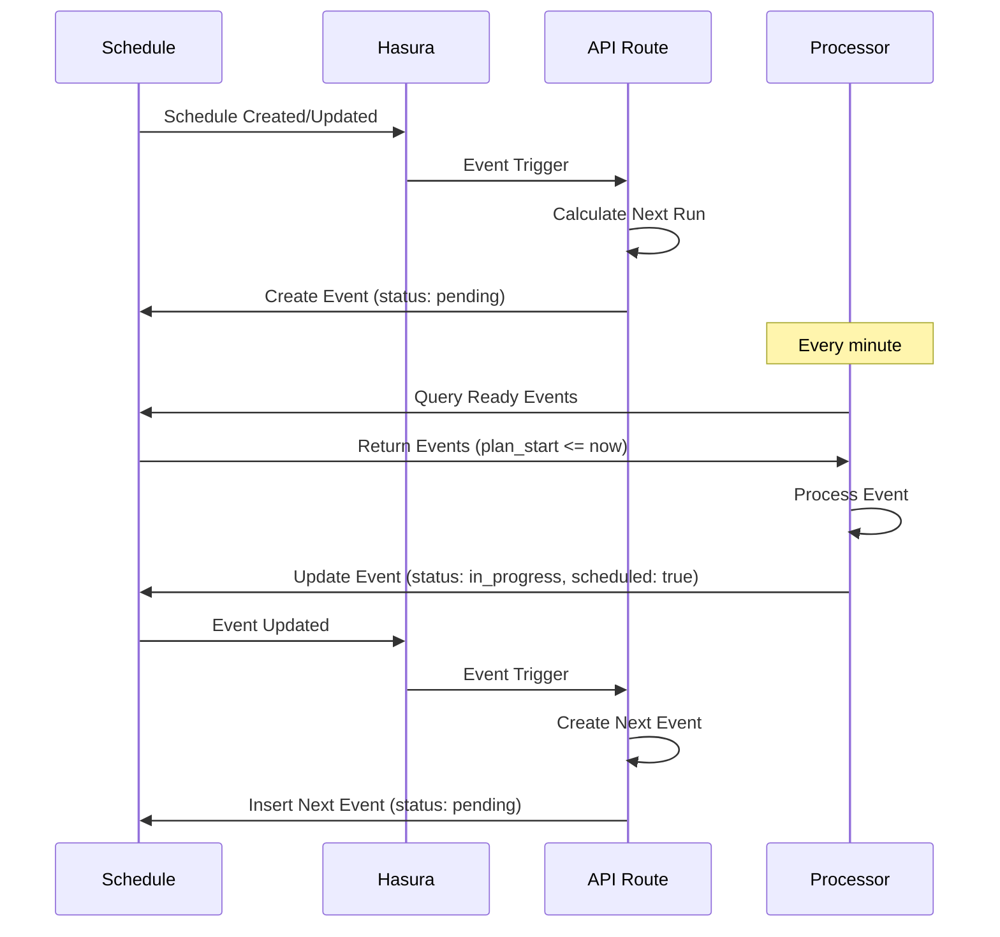

# Schedule System Documentation

The Hasyx Schedule system provides a comprehensive solution for managing timed events and recurring tasks. It combines the power of cron expressions with real-time database triggers to create a robust scheduling framework.

## Overview

The Schedule system enables you to:
- **Create schedules** with flexible cron expressions
- **Automatically generate events** based on schedule timing
- **Process events** in real-time through Hasura triggers
- **Handle complex timing scenarios** with proper cleanup and state management

## Architecture

### Database Schema

The Schedule system uses two main tables:

#### `schedule` table
```sql
CREATE TABLE public.schedule (
    id UUID PRIMARY KEY DEFAULT gen_random_uuid(),
    message_id UUID,
    cron TEXT NOT NULL,
    start_at BIGINT NOT NULL,
    end_at BIGINT NOT NULL,
    user_id UUID,
    created_at TIMESTAMPTZ DEFAULT NOW(),
    updated_at TIMESTAMPTZ DEFAULT NOW()
);
```

#### `events` table
```sql
CREATE TABLE public.events (
    id UUID PRIMARY KEY DEFAULT gen_random_uuid(),
    schedule_id UUID REFERENCES schedule(id),
    message_id UUID NOT NULL,
    user_id UUID,
    plan_start BIGINT,
    start BIGINT,
    end BIGINT,
    plan_end BIGINT,
    status TEXT DEFAULT 'pending',
    scheduled BOOLEAN DEFAULT FALSE,
    created_at TIMESTAMPTZ DEFAULT NOW(),
    updated_at TIMESTAMPTZ DEFAULT NOW()
);
```

### System Components



## Getting Started

### 1. Database Setup

Run the schedule migration to create the necessary tables:

```bash
npx hasyx migrate up-schedule
```

### 2. Event Triggers Configuration

Ensure your `events/` directory contains the required trigger configurations:

**events/schedule.json**
```json
{
  "name": "schedule",
  "table": {
    "schema": "public",
    "name": "schedule"
  },
  "webhook_path": "/api/events/schedule",
  "insert": { "columns": "*" },
  "update": { "columns": "*" },
  "delete": { "columns": "*" }
}
```

**events/schedule-cron.json**
```json
{
  "name": "schedule_processor_cron",
  "webhook_path": "/api/events/schedule-cron",
  "schedule": "* * * * *",
  "comment": "Process scheduled events every minute"
}
```

**events/events.json**
```json
{
  "name": "events",
  "table": {
    "schema": "public",
    "name": "events"
  },
  "webhook_path": "/api/events/events",
  "insert": { "columns": "*" },
  "update": { "columns": "*" },
  "delete": { "columns": "*" }
}
```

### 3. Sync Event Triggers

Deploy the event triggers to Hasura:

```bash
npx hasyx events
```

## Usage

### Creating a Schedule

#### Basic Schedule Creation

```typescript
import { useHasyx } from 'hasyx';

const hasyx = useHasyx();

// Create a schedule that runs every 5 minutes for 1 hour
const schedule = await hasyx.insert({
  table: 'schedule',
  objects: [{
    message_id: messageId,
    cron: '*/5 * * * *', // Every 5 minutes
    start_at: Math.floor(Date.now() / 1000), // Now
    end_at: Math.floor(Date.now() / 1000) + 3600, // 1 hour from now
    user_id: userId
  }]
});
```

#### Advanced Schedule with Specific Timing

```typescript
// Create a schedule for weekdays at 9 AM
const workdaySchedule = await hasyx.insert({
  table: 'schedule',
  objects: [{
    message_id: messageId,
    cron: '0 9 * * 1-5', // 9 AM, Monday to Friday
    start_at: Math.floor(Date.now() / 1000),
    end_at: Math.floor(Date.now() / 1000) + (30 * 24 * 60 * 60), // 30 days
    user_id: userId
  }]
});
```

### Querying Schedules and Events

#### Get Active Schedules

```typescript
const activeSchedules = await hasyx.select({
  table: 'schedule',
  where: {
    end_at: { _gt: Math.floor(Date.now() / 1000) },
    user_id: { _eq: userId }
  },
  returning: ['id', 'cron', 'start_at', 'end_at', 'created_at']
});
```

#### Get Events for a Schedule

```typescript
const scheduleEvents = await hasyx.select({
  table: 'events',
  where: {
    schedule_id: { _eq: scheduleId }
  },
  returning: ['id', 'plan_start', 'start', 'end', 'status', 'scheduled'],
  order_by: [{ plan_start: 'asc' }]
});
```

#### Get Upcoming Events

```typescript
const upcomingEvents = await hasyx.select({
  table: 'events',
  where: {
    plan_start: { _gt: Math.floor(Date.now() / 1000) },
    status: { _eq: 'pending' },
    user_id: { _eq: userId }
  },
  returning: ['id', 'schedule_id', 'message_id', 'plan_start', 'status'],
  order_by: [{ plan_start: 'asc' }],
  limit: 10
});
```

### Updating and Deleting Schedules

#### Update Schedule

```typescript
await hasyx.update({
  table: 'schedule',
  where: { id: { _eq: scheduleId } },
  _set: {
    cron: '*/10 * * * *', // Change to every 10 minutes
    end_at: Math.floor(Date.now() / 1000) + 7200 // Extend by 2 hours
  }
});
```

#### Delete Schedule

```typescript
await hasyx.delete({
  table: 'schedule',
  where: { id: { _eq: scheduleId } }
});
// Related events will be automatically cleaned up by event triggers
```

## Cron Expression Guide

### Basic Patterns

| Pattern | Description | Example |
|---------|-------------|---------|
| `* * * * *` | Every minute | Runs every minute |
| `*/5 * * * *` | Every 5 minutes | Runs at 0, 5, 10, 15, etc. |
| `0 * * * *` | Every hour | Runs at the top of every hour |
| `0 9 * * *` | Daily at 9 AM | Runs every day at 9:00 AM |
| `0 9 * * 1-5` | Weekdays at 9 AM | Runs Monday-Friday at 9:00 AM |
| `0 0 1 * *` | Monthly | Runs on the 1st of every month |

### Cron Format

```
* * * * *
│ │ │ │ │
│ │ │ │ └─── Day of Week (0-6, Sunday=0)
│ │ │ └───── Month (1-12)
│ │ └─────── Day of Month (1-31)
│ └───────── Hour (0-23)
└─────────── Minute (0-59)
```

### Advanced Examples

```typescript
// Business hours only (9 AM - 5 PM, weekdays)
const businessHours = {
  cron: '0 9-17 * * 1-5',
  start_at: Math.floor(Date.now() / 1000),
  end_at: Math.floor(Date.now() / 1000) + (90 * 24 * 60 * 60) // 90 days
};

// Weekly report (every Monday at 8 AM)
const weeklyReport = {
  cron: '0 8 * * 1',
  start_at: Math.floor(Date.now() / 1000),
  end_at: Math.floor(Date.now() / 1000) + (365 * 24 * 60 * 60) // 1 year
};

// End of month processing (last day of each month at 11 PM)
const endOfMonth = {
  cron: '0 23 28-31 * *',
  start_at: Math.floor(Date.now() / 1000),
  end_at: Math.floor(Date.now() / 1000) + (365 * 24 * 60 * 60) // 1 year
};
```

## Event Lifecycle

### Event States

1. **pending** - Event is created and waiting to be processed
2. **in_progress** - Event is currently being processed
3. **completed** - Event has been successfully processed
4. **cancelled** - Event was cancelled before processing

### Event Flow



## Custom Event Handlers

### Creating Custom Event Processors

You can create custom event handlers to define specific behavior when events are processed:

```typescript
import { EventRecord, ScheduleRecord } from 'hasyx/lib/schedule-event';
import { Hasyx } from 'hasyx';

export async function customEventHandler(
  hasyx: Hasyx,
  event: EventRecord,
  schedule?: ScheduleRecord
): Promise<void> {
  console.log(`Processing event ${event.id} for schedule ${schedule?.id}`);
  
  // Custom logic here
  if (event.message_id) {
    // Send notification
    await sendNotification(event.message_id);
  }
  
  // Update event status
  await hasyx.update({
    table: 'events',
    where: { id: { _eq: event.id } },
    _set: {
      status: 'completed',
      end: Math.floor(Date.now() / 1000)
    }
  });
}
```

### Using Custom Handlers in Cron Processor

```typescript
import { handleScheduleEvent } from 'hasyx/lib/schedule-event';
import { customEventHandler } from './custom-handler';

// In your cron API route
await handleScheduleEvent(hasyx, customEventHandler);
```

## Real-time Subscriptions

### Subscribe to Schedule Changes

```typescript
import { useSubscription } from 'hasyx';

const { data: schedules, loading, error } = useSubscription({
  table: 'schedule',
  where: { user_id: { _eq: userId } },
  returning: ['id', 'cron', 'start_at', 'end_at', 'created_at', 'updated_at']
});
```

### Subscribe to Event Updates

```typescript
const { data: events, loading, error } = useSubscription({
  table: 'events',
  where: { 
    schedule_id: { _eq: scheduleId },
    status: { _neq: 'completed' }
  },
  returning: ['id', 'plan_start', 'start', 'status', 'scheduled']
});
```

## Error Handling and Debugging

### Common Issues and Solutions

#### Schedule Not Creating Events

1. **Check cron expression validity**
   ```typescript
   import { calculateNextRun } from 'hasyx/lib/schedule-event';
   
   const nextRun = calculateNextRun('* * * * *', Math.floor(Date.now() / 1000));
   console.log('Next run:', nextRun ? new Date(nextRun * 1000) : 'Invalid');
   ```

2. **Verify schedule timing**
   ```typescript
   const currentTime = Math.floor(Date.now() / 1000);
   if (schedule.end_at <= currentTime) {
     console.log('Schedule has already ended');
   }
   ```

#### Events Not Being Processed

1. **Check cron trigger status** in Hasura Console
2. **Verify API route accessibility**
3. **Check event processor logs**

### Debug Mode

Enable debug logging for detailed information:

```bash
DEBUG=schedule-event npm run dev
```

### Monitoring Schedules

```typescript
// Get schedule statistics
const stats = await hasyx.select({
  table: 'schedule',
  returning: [
    { count: '*' },
    { active: { _where: { end_at: { _gt: Math.floor(Date.now() / 1000) } } } }
  ]
});

// Get event processing statistics
const eventStats = await hasyx.select({
  table: 'events',
  returning: [
    { pending: { _where: { status: { _eq: 'pending' } } } },
    { in_progress: { _where: { status: { _eq: 'in_progress' } } } },
    { completed: { _where: { status: { _eq: 'completed' } } } }
  ]
});
```

## Best Practices

### 1. Schedule Design

- **Use appropriate cron expressions** for your use case
- **Set reasonable end times** to prevent runaway schedules
- **Include cleanup logic** for cancelled or expired schedules

### 2. Event Processing

- **Keep event handlers lightweight** and fast
- **Handle errors gracefully** to prevent event processing failures
- **Use idempotent operations** to handle duplicate processing

### 3. Database Management

- **Use unique message_id** for event correlation
- **Implement proper user permissions** for schedule access
- **Monitor database performance** with complex schedules

### 4. Testing

- **Test with real database** connections as shown in the test suite
- **Verify event trigger behavior** in development environment
- **Use cleanup procedures** in tests to avoid data pollution

## API Reference

### Schedule Functions

```typescript
import { 
  calculateNextRun,
  handleScheduleChange,
  handleEventScheduled,
  processScheduledEvents,
  defaultEventHandler
} from 'hasyx/lib/schedule-event';
```

#### `calculateNextRun(cronExpression, fromTime)`
- **cronExpression**: Cron expression string
- **fromTime**: Unix timestamp to calculate from
- **Returns**: Next execution time or null if invalid

#### `handleScheduleChange(hasyx, schedule, operation)`
- **hasyx**: Hasyx client instance
- **schedule**: Schedule record
- **operation**: 'INSERT' | 'UPDATE' | 'DELETE'

#### `processScheduledEvents(hasyx, eventHandler)`
- **hasyx**: Hasyx client instance
- **eventHandler**: Custom event processing function

## Performance Considerations

### Scaling Schedules

- **Batch processing** for high-frequency schedules
- **Database indexing** on commonly queried fields
- **Partitioning** events table for large datasets

### Memory Management

- **Event cleanup** for completed events
- **Archive old schedules** to prevent table bloat
- **Monitor database connections** in high-load scenarios

## Security Considerations

### Access Control

- **User-based permissions** for schedule management
- **Event secret validation** for webhook security
- **Rate limiting** for schedule creation

### Data Protection

- **Sanitize cron expressions** to prevent injection
- **Validate time ranges** to prevent abuse
- **Audit trail** for schedule modifications

## Migration Guide

### From Manual Scheduling

If you're migrating from manual scheduling to the Schedule system:

1. **Identify recurring patterns** in your current system
2. **Convert timing logic** to cron expressions
3. **Implement event handlers** for existing functionality
4. **Test thoroughly** with the real database test suite

### Database Migration

```typescript
// Example migration for existing data
const existingTasks = await hasyx.select({
  table: 'old_tasks',
  where: { recurring: { _eq: true } }
});

for (const task of existingTasks) {
  await hasyx.insert({
    table: 'schedule',
    objects: [{
      message_id: task.id,
      cron: convertToCron(task.interval),
      start_at: task.next_run,
      end_at: task.expires_at,
      user_id: task.user_id
    }]
  });
}
```

## Related Documentation

- [Events System (EVENTS.md)](./EVENTS.md) - General event trigger documentation
- [Hasyx Client (HASYX.md)](./HASYX.md) - Database client documentation
- [Testing Guide](./README.md#testing) - Testing framework documentation

## Support

For issues with the Schedule system:

1. Check the [troubleshooting section](#error-handling-and-debugging)
2. Review the [test suite](./lib/schedule-event.test.ts) for examples
3. Examine the [API routes](./app/api/events/) for implementation details

The Schedule system is designed to be robust and production-ready, with comprehensive testing against real databases and proper error handling for edge cases. 